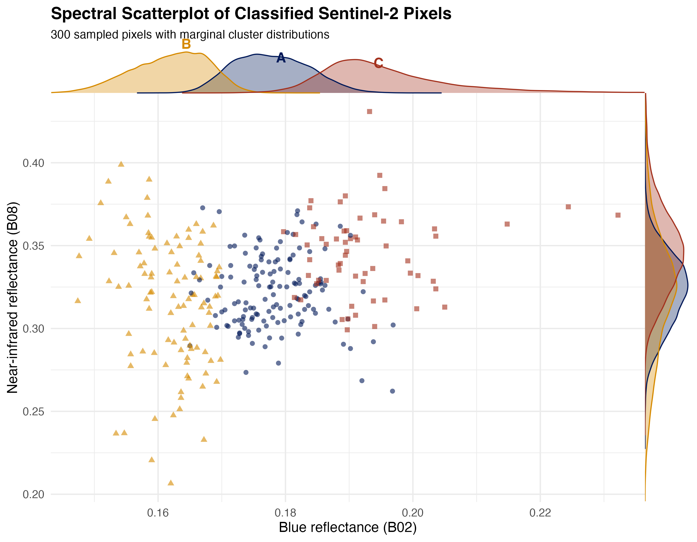

# iris_algorithms

+ scatterplot of bands pixels with classes and external distributions 🚧 

Spectral scatterplot of Sentinel-2 pixels with marginal density distributions

## Overview

A small R workflow that takes a Sentinel-2 satellite image, assigns pixels
to three groups based on their similarity in Blue, Green, and Red
reflectance, and draws a scatterplot showing how those groups are
distributed in spectral space.

The figure has:

* a **central scatterplot** of Blue reflectance against Near-infrared
  reflectance, with each pixel coloured and shaped by its group
* **density curves along the top and right edges**, showing how each group
  is distributed along each axis
* **direct labels** on the top curves (A, B, C), replacing the usual legend

## Files

```text
iris_algorithms/
├── README.md
├── scatter_plot.R
├── Scatter_Plot.Rmd
└── spectral_scatterplot_marginals.png
```

## The data

Sentinel-2B imagery, tile **T30NXN**, acquired **26 January 2022**.

Four 10 m bands are used:

| Band | Description   | Wavelength | Role                |
| ---- | ------------- | ---------: | ------------------- |
| B02  | Blue          |     490 nm | x-axis + clustering |
| B03  | Green         |     560 nm | clustering          |
| B04  | Red           |     665 nm | clustering          |
| B08  | Near-infrared |     842 nm | y-axis only         |


## Procedure

1. Four bands were loaded ** and combined into one raster.
2. A 4 km × 4 km area was cropped from the tile.
3. Scale reflectance from Sentinel-2's integer storage (×10,000) to
   approximately the 0–1 range.
4. The Blue, Green, and Red bands were put in clusters with k-means using three
   groups and seed 42. NIR is deliberately excluded from clustering so that
   the final scatterplot can show the resulting groups against a spectral
   band that was not used to create them.
5. A 300-pixel sample was used for the central scatterplot. The classification and
   marginal density curves use the full dataset.
6. Plot: Blue reflectance against NIR reflectance, coloured and shaped
   by group.
7. Attached density curves to the top and right edges using
   `cowplot::insert_xaxis_grob()` and `insert_yaxis_grob()`.
8. Labelled the top curves with the group letters A, B, and C, following
   Claus Wilke's approach of replacing a conventional legend with labels
   placed near the graphical elements.


## Packages Used

```r
install.packages(c("terra", "ggplot2", "dplyr", "cowplot", "imageRy"))
```

## The figure



## What the groups mean

The three groups are labelled **A**, **B**, and **C** by abundance — A is
the largest group and C the smallest. These are descriptive names only.
They are **not validated land-cover classes**.

The workflow is an exploratory analysis, not a land-cover map. The k-means
algorithm assigns pixels to groups according to their similarity in the
Blue, Green, and Red bands; it does not identify what those groups
correspond to on the ground.

## Reference

Wilke, C. O. (2019). *Fundamentals of Data Visualization: A Primer on
Making Informative and Compelling Figures*. O'Reilly Media.

https://clauswilke.com/dataviz/

European Space Agency. *Copernicus Sentinel-2 MSI Level-2A*. Tile T30NXN,
26 January 2022.

https://dataspace.copernicus.eu
